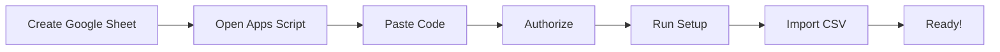
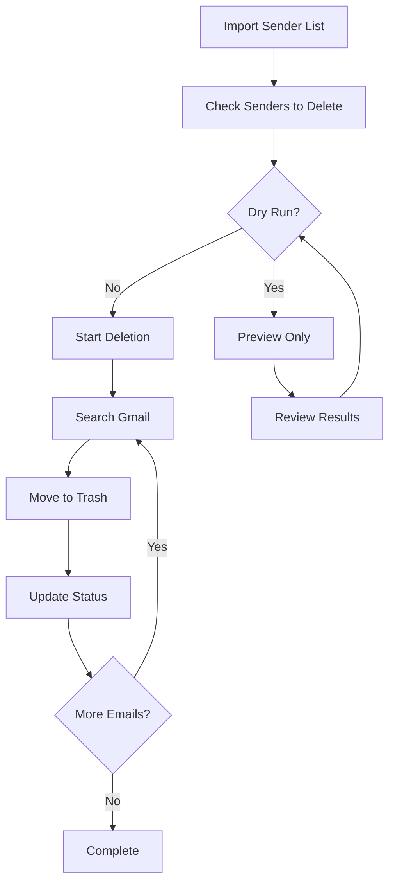
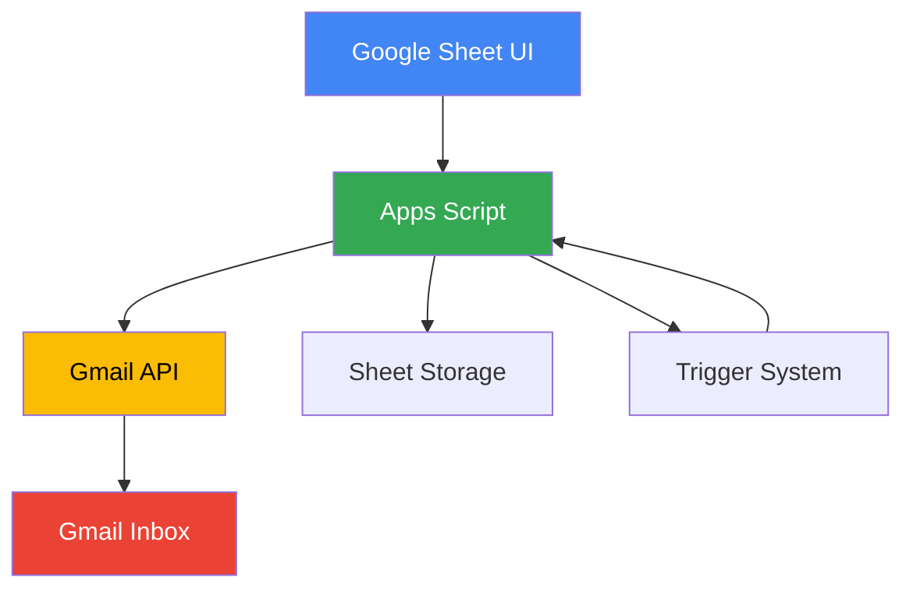
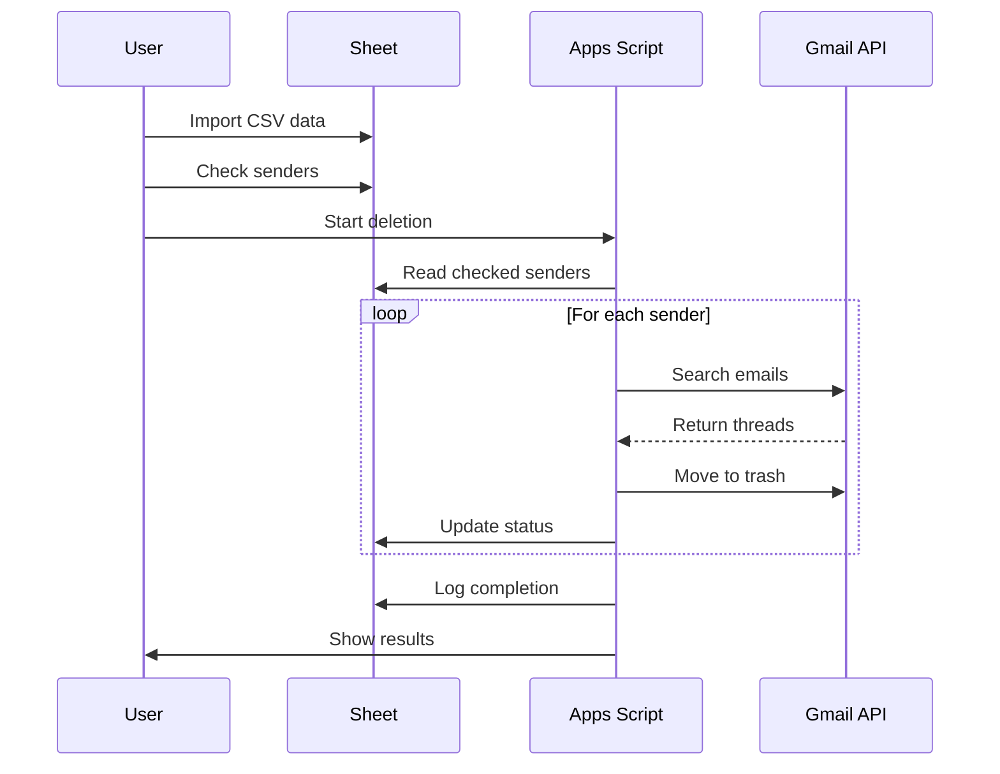

# 📧 Gmail Cleanup - Bulk Email Deletion Tool

[](https://opensource.org/licenses/MIT)
[](https://script.google.com)
[](https://github.com/Janith-Nilan/gmail-cleanup/graphs/commit-activity)
[](https://github.com/Janith-Nilan/gmail-cleanup/releases)

**Automate bulk deletion of emails in Gmail using Google Apps Script. Delete thousands of emails from unwanted senders with a simple spreadsheet interface.**

---

## ✨ Features

- **🚀 Automated Deletion**: Batch process thousands of emails automatically
- **📊 Spreadsheet Interface**: Manage deletion lists in familiar Google Sheets
- **🧪 Dry Run Mode**: Preview what will be deleted before making changes
- **📝 Detailed Logging**: Track every action with comprehensive logs
- **⏸️ Pause/Resume**: Stop and resume deletion at any time
- **🔒 Safe Deletion**: Emails moved to trash (30-day recovery period)
- **📈 Progress Tracking**: Real-time status updates for each sender
- **⚡ Quota Aware**: Respects Gmail's API limits (20,000 emails/day)
- **🔄 Auto-Resume**: Continues automatically with triggers
- **📋 CSV Import**: Easy import of sender lists

---

## 📋 Table of Contents

- [Quick Start](#-quick-start)
- [How It Works](#-how-it-works)
- [Installation](#-installation)
- [Usage Guide](#-usage-guide)
- [Configuration](#-configuration)
- [Architecture](#-architecture)
- [FAQ](#-faq)
- [Troubleshooting](#-troubleshooting)
- [Contributing](#-contributing)
- [License](#-license)

---

## 🚀 Quick Start

### Prerequisites

- Google Account with Gmail
- Access to Google Sheets and Apps Script
- CSV file with sender emails (see [sample_senders.csv](sample_senders.csv))

### Installation (5 minutes)



1. **Create Google Sheet**: [sheets.google.com](https://sheets.google.com) → New
2. **Open Apps Script**: Extensions → Apps Script
3. **Copy Code**: Paste contents of `Code.gs`
4. **Save & Run**: Save project → Run `setupMenu` → Authorize
5. **Setup**: Gmail Cleanup → Initial Setup
6. **Import**: Gmail Cleanup → Import CSV Data

**➡️ [Detailed Installation Guide](docs/INSTALLATION.md)**

---

## 🎯 How It Works



### Workflow

1. **Import**: Load CSV with unwanted sender emails
2. **Select**: Check boxes next to senders you want to delete
3. **Test**: Run Dry Run to preview (no deletion)
4. **Execute**: Disable Dry Run and start deletion
5. **Monitor**: Watch progress in Log sheet
6. **Complete**: Script runs automatically until done

---

## 💾 Installation

### Step-by-Step Guide

#### 1. Create Google Sheet

1. Go to [sheets.google.com](https://sheets.google.com)
2. Click **+ Blank** to create new spreadsheet
3. Name it: "Gmail Cleanup"

#### 2. Open Apps Script Editor

1. In Google Sheet: **Extensions** → **Apps Script**
2. Apps Script editor opens in new tab

#### 3. Add the Script

1. Delete any default code in editor
2. Copy entire contents of [`Code.gs`](Code.gs)
3. Paste into Apps Script editor
4. **Save**: File → Save (or Ctrl+S / Cmd+S)
5. Name project: "Gmail Cleanup Script"

#### 4. Run Setup Function

1. Select function: `setupMenu` from dropdown
2. Click **Run** ▶️ button
3. **Authorize** when prompted:
   - Click "Review permissions"
   - Choose your Google account
   - Click "Advanced"
   - Click "Go to Gmail Cleanup Script (unsafe)"
   - Click "Allow"

#### 5. Verify Installation

1. Close Apps Script tab
2. Return to Google Sheet
3. Refresh page (F5)
4. **Verify**: New menu "Gmail Cleanup" appears in menu bar

✅ **Installation Complete!**

---

## 📖 Usage Guide

### Initial Setup

#### 1. Create Sheets

```
Gmail Cleanup → Setup → 1️⃣ Initial Setup (Create Sheets)
```

This creates three sheets:
- **Senders**: Your deletion list
- **Log**: Activity tracking
- **Settings**: Configuration

#### 2. Import CSV Data

```
Gmail Cleanup → Setup → 2️⃣ Import CSV Data
```

1. Click menu item
2. Open your CSV file (e.g., `unnecessary_senders.csv`)
3. Copy all data
4. Paste into sheet at cell B2

**CSV Format:**
```csv
Email,Count,Category
newsletter@example.com,1250,Newsletter
promotions@store.com,567,Promotional
```

#### 3. Finalize Import

```
Gmail Cleanup → Setup → 3️⃣ Finalize Import (Add Checkboxes)
```

This adds checkboxes and formatting automatically.

#### 4. Test Setup

```
Gmail Cleanup → Setup → ✅ Test Setup
```

Verifies everything is configured correctly.

---

### Running Deletion

#### Testing First (Recommended)

1. **Check Test Senders**: In Senders sheet, check 2-3 test senders
2. **Verify Dry Run**: Settings sheet → Dry Run Mode = TRUE
3. **Run Preview**:
   ```
   Gmail Cleanup → 🧪 Dry Run (Preview)
   ```
4. **Check Results**: Log sheet shows what would be deleted
5. **Verify Counts**: Check "Emails Found" column in Senders sheet

#### Real Deletion

1. **Select Senders**: Check all senders you want to delete
2. **Disable Dry Run**: Settings sheet → Change TRUE to FALSE
3. **Start Deletion**:
   ```
   Gmail Cleanup → 🚀 Start Email Deletion
   ```
4. **Confirm**: Read warning and click Yes
5. **Monitor**: Watch Log sheet for progress

---

### Progress Monitoring

#### Senders Sheet Columns

| Column | Description |
|--------|-------------|
| Delete? | ☑️ Check to mark for deletion |
| Email | Sender email address |
| Count | Expected email count |
| Category | Classification |
| Status | Current status (Pending/Processing/Complete) |
| Emails Found | Actual count found in Gmail |
| Deleted | Number deleted so far |
| Last Updated | Timestamp of last action |

#### Status Values

- **Pending**: Not started yet
- **Processing...**: Currently deleting
- **In Progress**: Partially complete (will resume)
- **Complete**: All emails deleted
- **No emails found**: No emails from this sender
- **Error**: Something went wrong (check Log)

---

### Control Functions

#### Pause Deletion

```
Gmail Cleanup → ⏸️ Stop Deletion
```

Stops automatic processing. Progress is saved.

#### Resume Deletion

```
Gmail Cleanup → ▶️ Resume Deletion
```

Continues from where it stopped.

#### Refresh Stats

```
Gmail Cleanup → 📊 Refresh Stats
```

Shows summary of progress.

#### Reset Status

```
Gmail Cleanup → 🔄 Reset Status
```

Resets all statuses to "Pending" (for re-running).

---

## ⚙️ Configuration

### Settings Sheet

| Setting | Default | Description |
|---------|---------|-------------|
| **Dry Run Mode** | TRUE | Set to FALSE to enable deletion |
| **Batch Size** | 50 | Emails per batch (50-200) |
| **Daily Limit** | 18,000 | Max per day (Gmail limit: 20,000) |
| **Total Deleted Today** | 0 | Auto-updated counter |
| **Last Run Date** | - | Auto-updated timestamp |

### Adjusting Performance

**For Faster Deletion:**
- Increase Batch Size to 100-200
- Risk: May timeout on slower connections

**For Stability:**
- Keep Batch Size at 50
- More reliable on slower connections

### Gmail Quotas

Google Apps Script Limits:
- **20,000 emails/day**: Hard Gmail limit
- **6 minutes/execution**: Script runtime limit
- **90 triggers/day**: Auto-run limit

Script automatically:
- ✅ Respects daily quota
- ✅ Restarts after timeout
- ✅ Resumes next day if quota reached

---

## 🏗️ Architecture

### System Overview



### Components

#### 1. User Interface Layer
- **Google Sheets**: Data input/output
- **Custom Menu**: User actions
- **Three Sheets**:
  - Senders: Deletion list
  - Log: Activity history
  - Settings: Configuration

#### 2. Script Layer
- **Menu Functions**: User-triggered actions
- **Core Functions**: Email processing logic
- **Helper Functions**: Utilities and helpers
- **Trigger System**: Automated execution

#### 3. Gmail Integration
- **GmailApp API**: Email search and deletion
- **Batch Processing**: Handles quota limits
- **Error Handling**: Retry logic

### Data Flow



### Script Functions

#### Core Functions

| Function | Purpose |
|----------|---------|
| `processEmails()` | Main processing loop |
| `startDeletion()` | Initialize deletion |
| `dryRun()` | Preview mode |

#### Setup Functions

| Function | Purpose |
|----------|---------|
| `initialSetup()` | Create sheets |
| `importCSVData()` | Import data |
| `finalizeImport()` | Add checkboxes |

#### Helper Functions

| Function | Purpose |
|----------|---------|
| `getCheckedSenders()` | Get deletion list |
| `updateSenderStatus()` | Update progress |
| `logMessage()` | Record activity |
| `setupTriggers()` | Auto-run setup |

---

## 🔍 Performance

### Benchmarks

| Scenario | Emails | Time | Rate |
|----------|--------|------|------|
| Small cleanup | 1,000 | ~30 min | 33/min |
| Medium cleanup | 10,000 | ~5 hours | 33/min |
| Large cleanup | 50,000 | ~25 hours | 33/min |
| Max daily | 18,000 | ~9 hours | 33/min |

### Optimization Tips

1. **Batch Size**: Start with 50, increase to 100 if stable
2. **Run overnight**: Let it run unattended
3. **Check logs**: Monitor for errors
4. **Pause if needed**: Can stop and resume anytime

### Resource Usage

- **Memory**: ~50 MB (Apps Script)
- **API Calls**: ~2 per email (search + delete)
- **Sheet Operations**: Minimal (status updates only)

---

## ❓ FAQ

### General Questions

**Q: Is this safe?**  
A: Yes! Emails are moved to trash, not permanently deleted. 30-day recovery period.

**Q: Can I undo deletions?**  
A: Yes, within 30 days. Go to Gmail Trash and restore emails.

**Q: Does this work with G Suite/Workspace?**  
A: Yes, works with all Gmail accounts.

**Q: Will this delete important emails?**  
A: Only emails from senders YOU check in the list. Always test with Dry Run first.

### Technical Questions

**Q: Why is it slow?**  
A: Gmail has quota limits (20,000/day). Script optimized for reliability over speed.

**Q: Can I run multiple instances?**  
A: No, one per Gmail account. Running multiple may hit quota limits.

**Q: Does it work while my computer is off?**  
A: Yes! Runs on Google's servers, not your computer.

**Q: Can I delete from specific labels/folders?**  
A: No, searches all mail. You can modify the search query in the code.

### Troubleshooting

**Q: "Authorization required" error?**  
A: Re-run `setupMenu` function and re-authorize.

**Q: Menu not appearing?**  
A: Refresh the sheet or re-run `setupMenu` function.

**Q: Emails not deleting?**  
A: Check Settings sheet - Dry Run Mode must be FALSE.

**Q: Script timing out?**  
A: Reduce Batch Size to 50 in Settings sheet.

---

## 🐛 Troubleshooting

### Common Issues

#### 1. Authorization Errors

**Symptom**: "You do not have permission"

**Solution**:
```
1. Apps Script editor → Run any function
2. Click "Review permissions"
3. Choose your account
4. Click "Advanced" → "Go to script (unsafe)"
5. Click "Allow"
```

#### 2. Menu Not Appearing

**Symptom**: No "Gmail Cleanup" menu

**Solutions**:
- Refresh the sheet (F5)
- Re-run `setupMenu` function
- Close and reopen the sheet

#### 3. Dry Run Not Working

**Symptom**: Emails deleted in Dry Run mode

**Solution**:
- Check Settings sheet
- Ensure "Dry Run Mode" = TRUE
- Re-run with correct setting

#### 4. Script Timing Out

**Symptom**: "Exceeded maximum execution time"

**Solutions**:
- Reduce Batch Size to 25-50
- Script will auto-resume
- Normal behavior for large deletions

#### 5. Daily Quota Reached

**Symptom**: "Daily quota reached"

**Solution**:
- Script automatically pauses
- Will resume tomorrow
- This is normal for large cleanups

### Debug Mode

Enable detailed logging:

```javascript
// In Code.gs, add at top:
const DEBUG = true;

// Then check Apps Script logs:
// View → Logs
```

### Getting Help

1. Check [Troubleshooting Guide](docs/TROUBLESHOOTING.md)
2. Review Log sheet in your spreadsheet
3. Check Apps Script Execution log (View → Executions)
4. Open an [issue](https://github.com/Janith-Nilan/gmail-cleanup/issues)

---

## 📊 Example Use Cases

### 1. Newsletter Cleanup

Delete 10,000+ newsletter emails

```csv
Email,Count,Category
newsletter@site1.com,2341,Newsletter
updates@site2.com,1876,Newsletter
digest@site3.com,1543,Newsletter
```

**Result**: ~5 hours automated deletion

### 2. Social Media Notifications

Clean up Facebook, LinkedIn, Twitter notifications

```csv
Email,Count,Category
notification@facebookmail.com,5432,Social
notifications@linkedin.com,3210,Social
notify@twitter.com,2109,Social
```

**Result**: ~6 hours automated deletion

### 3. Promotional Cleanup

Remove all promotional emails

```csv
Email,Count,Category
deals@store1.com,1234,Promotional
offers@store2.com,987,Promotional
sales@store3.com,765,Promotional
```

**Result**: ~2 hours automated deletion

---

## 🤝 Contributing

Contributions are welcome! Please read our [Contributing Guide](CONTRIBUTING.md).

### Development Setup

1. Fork the repository
2. Create feature branch: `git checkout -b feature-name`
3. Make changes
4. Test thoroughly
5. Submit pull request

### Code Style

- Use JSDoc comments
- Follow existing patterns
- Add error handling
- Update documentation

---

## 📄 License

This project is licensed under the MIT License - see the [LICENSE](LICENSE) file for details.

---

## 🙏 Acknowledgments

- Built with [Google Apps Script](https://developers.google.com/apps-script)
- Inspired by the need for bulk email management
- Thanks to all contributors

---

## 📞 Support

- **Documentation**: [docs/](docs/)
- **Issues**: [GitHub Issues](https://github.com/Janith-Nilan/gmail-cleanup/issues)
- **Discussions**: [GitHub Discussions](https://github.com/Janith-Nilan/gmail-cleanup/discussions)

---

## 🗺️ Roadmap

- [ ] Multi-label support
- [ ] Advanced search filters
- [ ] Email export before deletion
- [ ] Statistics dashboard
- [ ] Scheduled automatic cleanups
- [ ] Integration with other email services

---

## 📈 Project Stats


---

<p align="center">
Made with ❤️ for email productivity
</p>

<p align="center">
<a href="#-quick-start">Quick Start</a> •
<a href="#-installation">Installation</a> •
<a href="#-usage-guide">Usage</a> •
<a href="#-faq">FAQ</a> •
<a href="docs/">Documentation</a>
</p>
