# Architecture Documentation

Technical architecture and design documentation for Gmail Cleanup tool.

---

## Table of Contents

- [System Overview](#system-overview)
- [Component Architecture](#component-architecture)
- [Data Flow](#data-flow)
- [Core Functions](#core-functions)
- [State Management](#state-management)
- [Error Handling](#error-handling)
- [Performance Optimization](#performance-optimization)
- [API Integration](#api-integration)

---

## System Overview

### High-Level Architecture

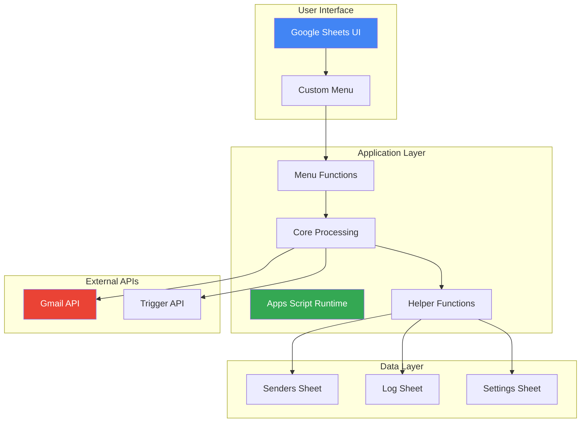

### Technology Stack

| Layer | Technology | Purpose |
|-------|-----------|---------|
| **Frontend** | Google Sheets | User interface |
| **Backend** | Google Apps Script | Business logic |
| **Storage** | Google Sheets | Data persistence |
| **Email API** | Gmail API | Email operations |
| **Scheduling** | Apps Script Triggers | Automation |

---

## Component Architecture

### 1. User Interface Layer

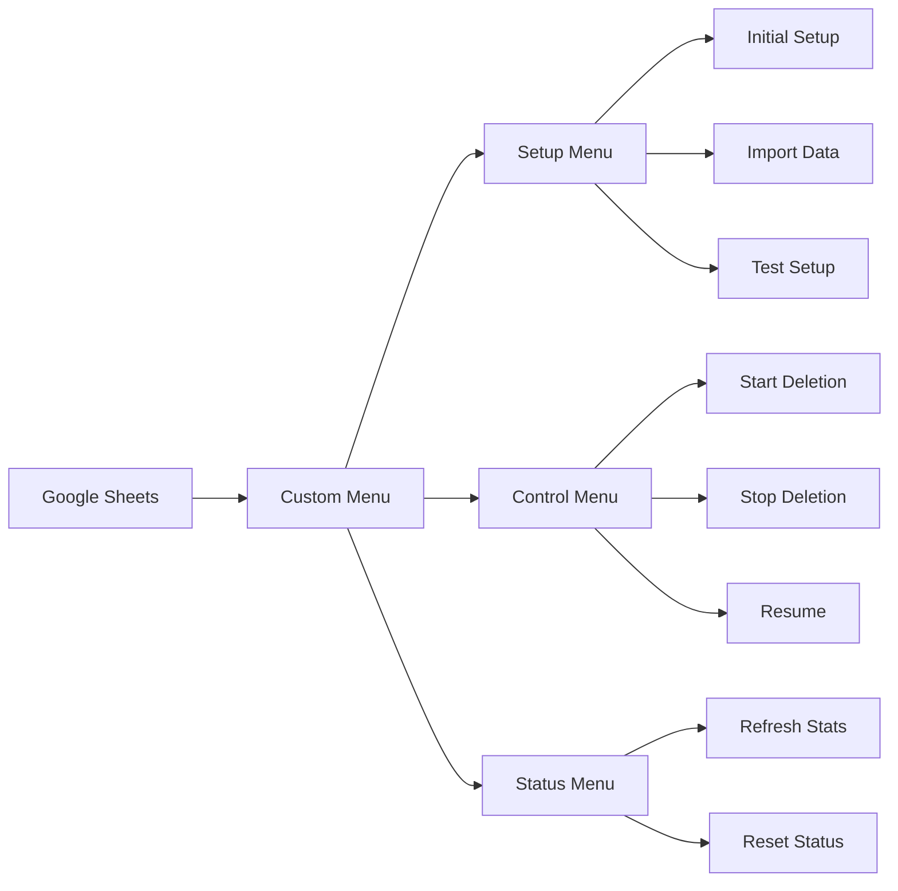

**Components:**

- **Custom Menu**: User-facing actions
- **Senders Sheet**: Interactive data grid
- **Log Sheet**: Real-time activity log
- **Settings Sheet**: Configuration interface

### 2. Application Layer

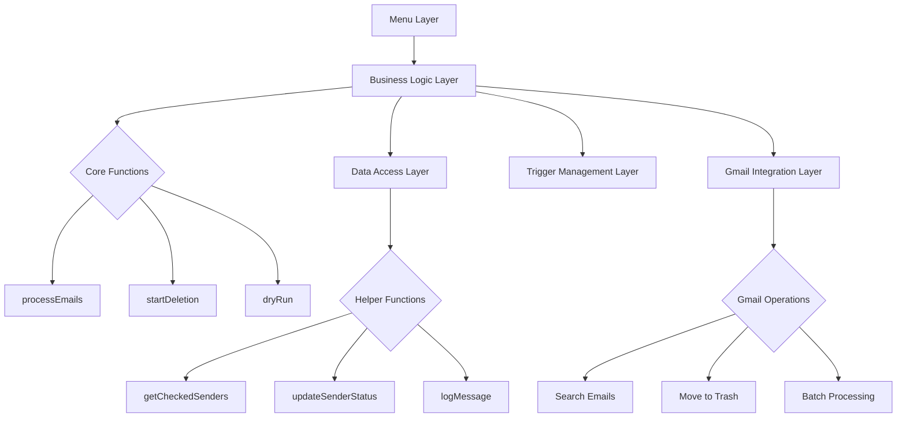

**Layers:**

1. **Menu Layer**: User-triggered functions
2. **Business Logic**: Core processing logic
3. **Data Access**: Sheet read/write operations
4. **Gmail Integration**: API calls
5. **Trigger Management**: Automation

### 3. Data Layer

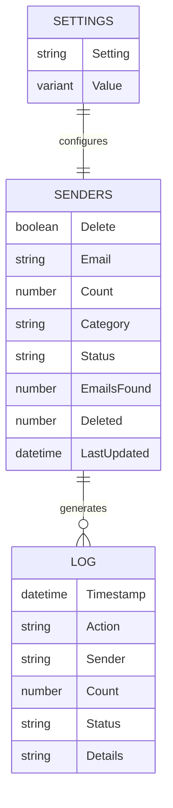

**Sheets:**

- **Senders**: Master deletion list
- **Log**: Activity audit trail
- **Settings**: Runtime configuration

---

## Data Flow

### Complete Deletion Flow

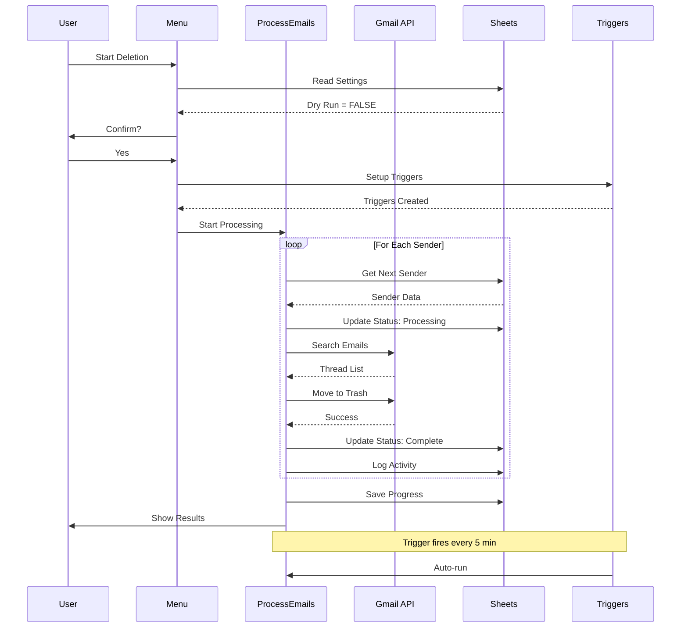

### State Transitions

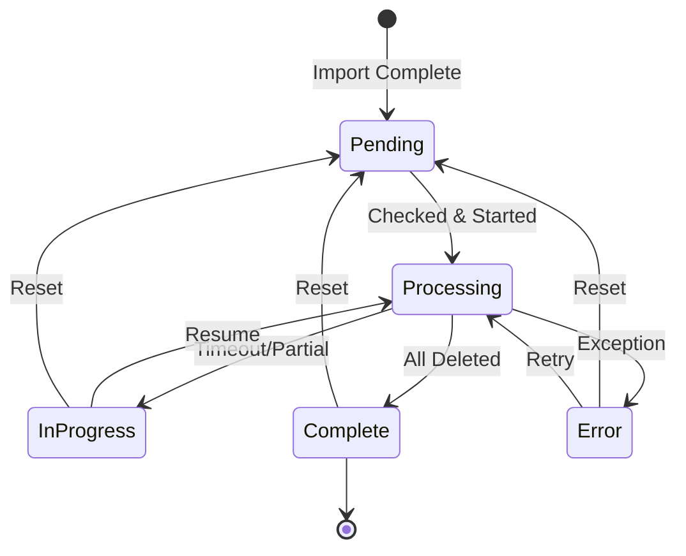

**States:**

- **Pending**: Initial state, not started
- **Processing**: Currently deleting emails
- **InProgress**: Partially complete, will resume
- **Complete**: All emails deleted
- **Error**: Exception occurred
- **No emails found**: Sender has no emails

---

## Core Functions

### Function Hierarchy

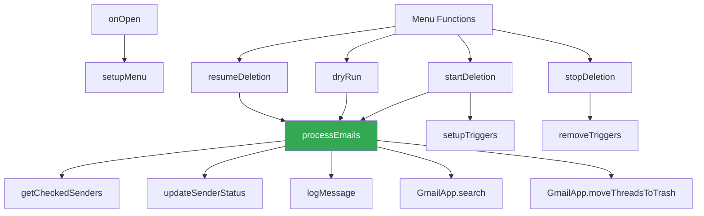

### Key Functions

#### 1. processEmails()

**Purpose**: Main processing loop

**Pseudocode:**
```javascript
function processEmails() {
  // Check daily quota
  if (quotaReached) return;
  
  // Get pending senders
  senders = getCheckedSenders();
  if (senders.length == 0) {
    removeTriggers();
    return;
  }
  
  // Process each sender
  for each sender {
    // Check runtime limit
    if (timeoutReached) break;
    
    // Search Gmail
    threads = GmailApp.search(query);
    
    // Delete (if not dry run)
    if (!isDryRun) {
      GmailApp.moveThreadsToTrash(threads);
    }
    
    // Update status
    updateSenderStatus(sender, status);
    logMessage(action, sender, count);
  }
  
  // Save progress
  updateDeletedToday(count);
}
```

**Key Features:**
- ⏰ Runtime limit checking
- 📊 Quota management
- 🔄 Resume capability
- 📝 Progress tracking

#### 2. startDeletion()

**Purpose**: Initialize deletion process

**Workflow:**
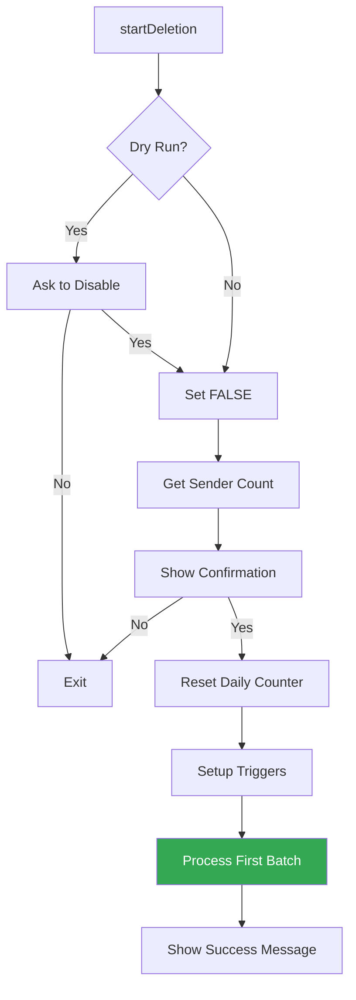

#### 3. setupTriggers()

**Purpose**: Create automated execution schedule

**Implementation:**
```javascript
function setupTriggers() {
  // Remove existing
  removeTriggers();
  
  // Create new trigger
  ScriptApp.newTrigger('processEmails')
    .timeBased()
    .everyMinutes(5)  // Google limit: 1,5,10,15,30
    .create();
}
```

---

## State Management

### Configuration State

Stored in **Settings** sheet:

```javascript
const CONFIG = {
  SHEETS: {
    SENDERS: 'Senders',
    LOG: 'Log',
    SETTINGS: 'Settings'
  },
  COLUMNS: {
    DELETE: 0,    // A
    EMAIL: 1,     // B
    COUNT: 2,     // C
    CATEGORY: 3,  // D
    STATUS: 4,    // E
    FOUND: 5,     // F
    DELETED: 6,   // G
    UPDATED: 7    // H
  },
  SETTINGS_ROWS: {
    DRY_RUN: 2,
    BATCH_SIZE: 3,
    DAILY_LIMIT: 4,
    TOTAL_TODAY: 5,
    LAST_RUN: 6
  },
  BATCH_SIZE: 50,
  DAILY_LIMIT: 18000,
  MAX_RUNTIME: 240000,  // 4 min
  SLEEP_BETWEEN_BATCHES: 2000,  // 2 sec
  TRIGGER_INTERVAL: 5  // min
};
```

### Runtime State

Tracked in sheets:

```javascript
// Sender State
{
  row: 2,
  email: "sender@example.com",
  count: 1250,
  status: "Processing",
  found: 1248,
  deleted: 625
}

// Session State
{
  dryRun: false,
  batchSize: 50,
  dailyLimit: 18000,
  deletedToday: 1234,
  lastRun: new Date()
}
```

---

## Error Handling

### Error Strategy

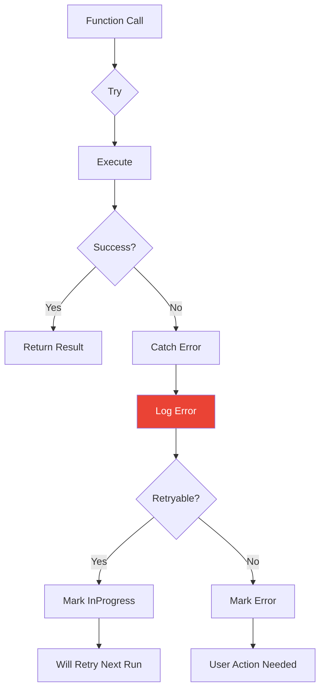

### Error Categories

| Category | Action | Example |
|----------|--------|---------|
| **Transient** | Retry | API timeout |
| **Quota** | Pause | Daily limit |
| **Permission** | Alert user | Auth expired |
| **Data** | Skip | Invalid email |
| **System** | Log & continue | Sheet error |

### Implementation

```javascript
try {
  // Risky operation
  GmailApp.moveThreadsToTrash(threads);
  
} catch (error) {
  // Log for debugging
  logMessage('ERROR', sender, error.toString(), 0);
  
  // Update status
  updateSenderStatus(row, 'Error: ' + error.message);
  
  // Continue processing next sender
  continue;
}
```

---

## Performance Optimization

### Batch Processing Strategy

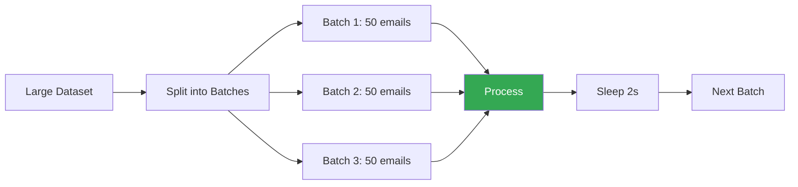

### Optimization Techniques

#### 1. Runtime Management

```javascript
const MAX_RUNTIME = 240000;  // 4 min (leave 2 min buffer)
const startTime = new Date().getTime();

while (hasSenders && !timeoutReached) {
  // Process batch
  
  // Check time
  if (new Date().getTime() - startTime > MAX_RUNTIME) {
    break;  // Will resume on next trigger
  }
}
```

#### 2. Quota Management

```javascript
// Daily quota tracking
const DAILY_LIMIT = 18000;
let deletedToday = getDeletedToday();

if (deletedToday >= DAILY_LIMIT) {
  logMessage('INFO', 'LIMIT', 'Daily quota reached');
  removeTriggers();  // Stop until tomorrow
  return;
}
```

#### 3. API Call Optimization

```javascript
// Batch API calls
const threads = GmailApp.search(query, 0, BATCH_SIZE);

// Single move operation (not per-thread)
GmailApp.moveThreadsToTrash(threads);

// Sleep between batches
Utilities.sleep(SLEEP_BETWEEN_BATCHES);
```

### Performance Metrics

| Metric | Value | Notes |
|--------|-------|-------|
| **Batch Size** | 50 emails | Optimal for stability |
| **Processing Rate** | 33 emails/min | With 2s sleep |
| **Max per execution** | ~100 emails | 4 min runtime |
| **Executions/hour** | 12 | Every 5 minutes |
| **Throughput/hour** | ~1,200 emails | Automated |
| **Daily capacity** | 18,000 emails | Gmail limit |

---

## API Integration

### Gmail API Usage

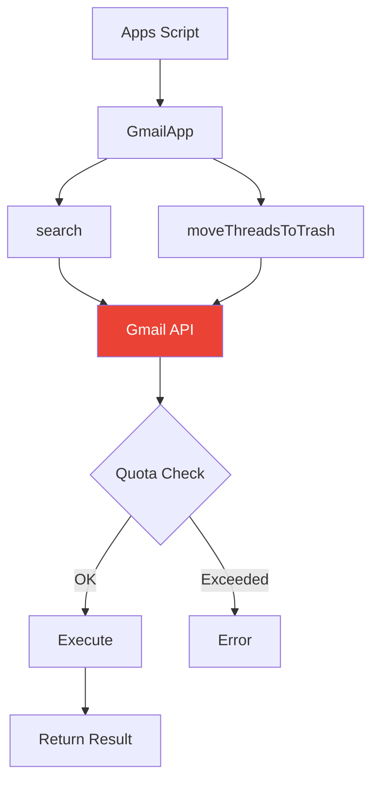

### API Methods Used

| Method | Purpose | Quota Impact |
|--------|---------|--------------|
| `GmailApp.search()` | Find emails | 1 call |
| `GmailApp.moveThreadsToTrash()` | Delete batch | 1 call per batch |
| `SpreadsheetApp.*` | Sheet operations | Minimal |
| `ScriptApp.newTrigger()` | Create triggers | 1 per setup |

### Quota Limits

**Gmail API (per day):**
- 20,000 emails can be deleted
- Unlimited searches (within reason)

**Apps Script (per day):**
- 6 minutes per execution
- 90 minutes total runtime
- 20,000 UrlFetch calls
- Unlimited sheet operations

**Trigger Limits:**
- 20 concurrent triggers
- 90 triggers per day

---

## Security Considerations

### Authorization Scopes

Required OAuth scopes:
```
https://www.googleapis.com/auth/gmail.modify
https://www.googleapis.com/auth/spreadsheets
https://www.googleapis.com/auth/script.scriptapp
```

### Data Privacy

- ✅ All data stays in user's Google account
- ✅ No external API calls
- ✅ No data sent to third parties
- ✅ Script runs under user's permissions

### Best Practices

1. **Least Privilege**: Only request needed scopes
2. **Dry Run**: Test before deletion
3. **Audit Log**: Track all actions
4. **Reversible**: Use trash, not permanent delete
5. **User Confirmation**: Require explicit approval

---

## Scalability

### Current Limits

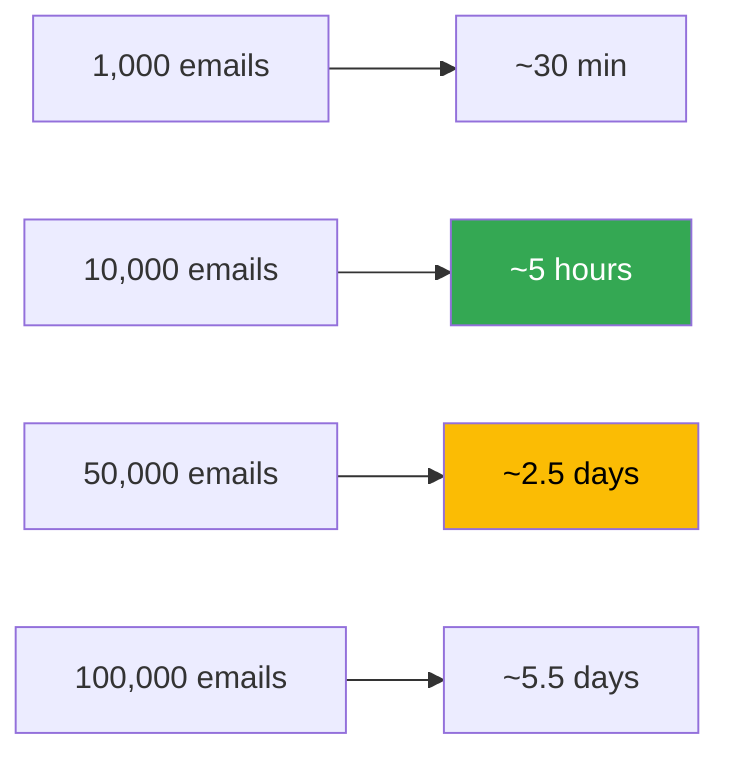

### Scaling Strategies

**Current:**
- Single-threaded processing
- Sequential sender processing
- Automatic resume on timeout

**Potential Improvements:**
- Parallel sender processing (if Google allows)
- Adaptive batch sizing
- Predictive scheduling
- Multi-account support

---

## Testing Architecture

### Test Levels

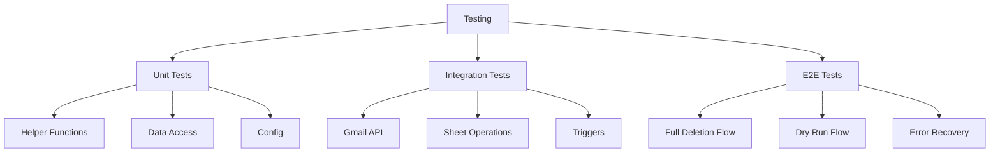

### Manual Testing

See [Testing Guide](TESTING.md) for:
- Setup validation
- Dry run testing
- Small batch testing
- Error scenario testing

---

## Future Architecture

### Roadmap Considerations

1. **Multi-Label Support**
   - Search within specific labels
   - Selective deletion by folder

2. **Advanced Filters**
   - Date ranges
   - Subject patterns
   - Attachment filters

3. **Statistics Dashboard**
   - Visual progress charts
   - Deletion history
   - Storage savings

4. **Export Feature**
   - Backup before delete
   - Archive to Drive
   - CSV export of logs

---

## References

- [Google Apps Script Documentation](https://developers.google.com/apps-script)
- [Gmail API Reference](https://developers.google.com/gmail/api)
- [Apps Script Best Practices](https://developers.google.com/apps-script/guides/services/best-practices)

---

<p align="center">
<a href="../README.md">← Back to README</a> •
<a href="INSTALLATION.md">Installation Guide</a> •
<a href="USAGE.md">Usage Guide</a>
</p>
