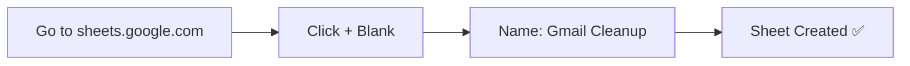
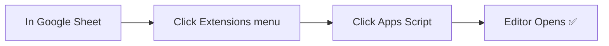
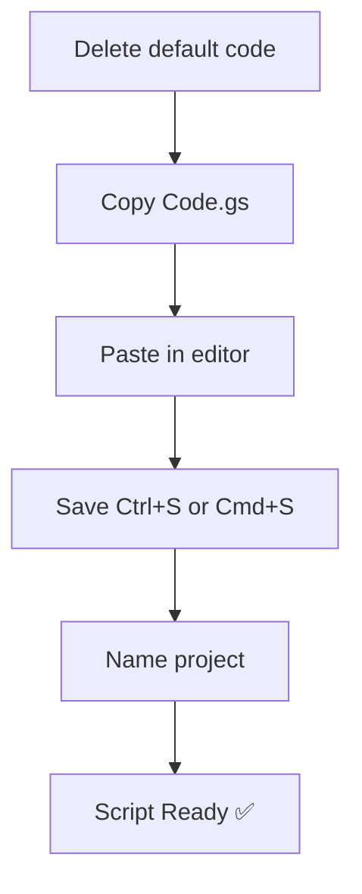
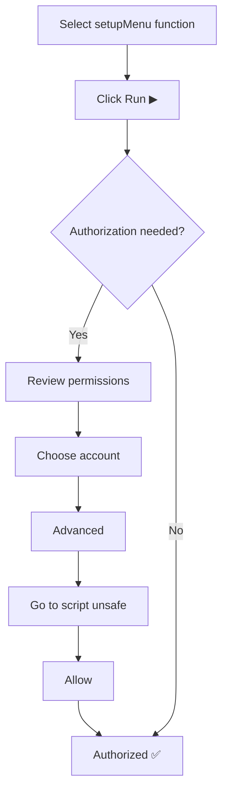
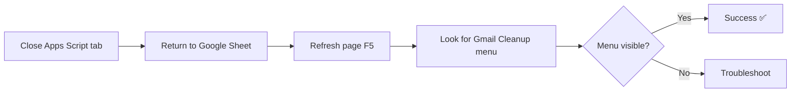

# Installation Guide

Complete step-by-step installation instructions for Gmail Cleanup tool.

---

## Table of Contents

- [Prerequisites](#prerequisites)
- [Installation Methods](#installation-methods)
- [Step-by-Step Installation](#step-by-step-installation)
- [Verification](#verification)
- [Common Issues](#common-issues)
- [Next Steps](#next-steps)

---

## Prerequisites

### Required

✅ **Google Account** with Gmail  
✅ **Google Sheets** access  
✅ **Google Apps Script** access  
✅ **CSV file** with sender list (or use provided sample)

### Recommended

⭐ **Chrome browser** (best compatibility)  
⭐ **Desktop/laptop** (mobile not recommended for setup)  
⭐ **15 minutes** of setup time

---

## Installation Methods

### Method 1: Bound Script (Recommended)

Script attached directly to your Google Sheet.

**Pros:**
- ✅ Custom menu appears in sheet
- ✅ Easier to use
- ✅ Better integration
- ✅ Simpler code

**Setup time:** 10 minutes

### Method 2: Standalone Script

Script runs independently at script.google.com

**Pros:**
- ✅ Can manage multiple sheets
- ✅ More flexible

**Cons:**
- ⚠️ Requires sheet ID configuration
- ⚠️ More complex setup

**Setup time:** 20 minutes

**➡️ We recommend Method 1 for most users**

---

## Step-by-Step Installation

### Method 1: Bound Script (Recommended)

#### Step 1: Create Google Sheet (1 minute)



1. Open browser
2. Go to: [sheets.google.com](https://sheets.google.com)
3. Click **+ Blank** (create new spreadsheet)
4. Click "Untitled spreadsheet" at top
5. Rename to: **"Gmail Cleanup"**
6. Press Enter

✅ **Checkpoint**: You have a blank Google Sheet

---

#### Step 2: Open Apps Script Editor (1 minute)



1. In your Google Sheet
2. Top menu: Click **Extensions**
3. Click **Apps Script**
4. New tab opens with Apps Script editor

✅ **Checkpoint**: You see Apps Script editor with default code

**Troubleshooting:**
- If you get "Unable to open file" error:
  - Sign out of all Google accounts
  - Sign in to only ONE account
  - Try again
- If Extensions menu missing:
  - Check you're using a desktop browser
  - Try Chrome browser

---

#### Step 3: Add the Script (3 minutes)



1. **Delete default code**
   - Select all code in editor (Cmd+A or Ctrl+A)
   - Delete it

2. **Copy the script**
   - Open `Code.gs` from this repository
   - Select all (Cmd+A or Ctrl+A)
   - Copy (Cmd+C or Ctrl+C)

3. **Paste into editor**
   - Click in Apps Script editor
   - Paste (Cmd+V or Ctrl+V)

4. **Save the script**
   - File → Save
   - Or press Cmd+S (Mac) / Ctrl+S (Windows)

5. **Name the project**
   - Click "Untitled project" at top
   - Rename to: **"Gmail Cleanup Script"**
   - Press Enter

✅ **Checkpoint**: Script saved with 1,187 lines of code

---

#### Step 4: Run and Authorize (4 minutes)



1. **Select function**
   - Find dropdown near Run button
   - Select: **`setupMenu`**

2. **Run the function**
   - Click **Run** ▶️ button
   - Wait for execution

3. **Authorization dialog appears**
   - Click: **"Review permissions"**

4. **Choose your account**
   - Select the Google account with your Gmail
   - The same account you're signed into

5. **Warning screen**
   - Google shows: "This app isn't verified"
   - This is normal for personal scripts
   - Click: **"Advanced"** (bottom left)

6. **Grant access**
   - Click: **"Go to Gmail Cleanup Script (unsafe)"**
   - Don't worry - it's YOUR script, it's safe!

7. **Permission list**
   - Review permissions:
     - View and manage spreadsheets
     - View and modify Gmail messages
   - Click: **"Allow"**

8. **Execution completes**
   - Check ✅ appears next to Run button
   - Or see "Execution completed" in execution log

✅ **Checkpoint**: Script authorized and executed successfully

**What just happened:**
- Granted script permission to access Gmail
- Granted script permission to modify spreadsheet
- Script ran `setupMenu` function
- Menu system initialized

---

#### Step 5: Verify Installation (1 minute)



1. **Close Apps Script tab**
   - Close the Apps Script browser tab

2. **Return to Google Sheet**
   - Go back to your Gmail Cleanup sheet

3. **Refresh the page**
   - Press F5
   - Or Cmd+R (Mac) / Ctrl+R (Windows)

4. **Check for menu**
   - Look in top menu bar
   - You should see: **"Gmail Cleanup"** menu
   - Between "Help" and "Last edit was..."

5. **Click the menu**
   - Click "Gmail Cleanup"
   - You should see submenu with options:
     - 📋 Setup
     - 🧪 Dry Run
     - 🚀 Start Email Deletion
     - etc.

✅ **Installation Complete!** The menu confirms everything works.

---

## Verification Checklist

After installation, verify these items:

### Visual Checks

- [ ] Google Sheet exists and is named "Gmail Cleanup"
- [ ] Apps Script project exists (Extensions → Apps Script)
- [ ] Script code is 1,187 lines (check scroll bar)
- [ ] "Gmail Cleanup" menu appears in sheet menu bar
- [ ] Menu has submenus when clicked

### Functional Checks

Run this test:

```
Gmail Cleanup → Setup → ✅ Test Setup
```

Expected result:
```
Setup Test - SUCCESS ✅

All tests passed!

Sheets: Found
Gmail Access: Working
Checked Senders: 0
Dry Run Mode: true
Batch Size: 50

Ready to run!
```

If you see this ✅ → Installation verified!

---

## Common Issues

### Issue 1: "Unable to open the file"

**When:** Clicking Extensions → Apps Script

**Cause:** Multiple Google accounts signed in

**Solution:**
```
1. Sign out of ALL Google accounts
2. Visit: accounts.google.com/Logout
3. Sign in to ONLY ONE account
4. Try again
```

**Alternative:** Try in Incognito/Private mode

---

### Issue 2: Menu Not Appearing

**When:** After installation, no "Gmail Cleanup" menu

**Solutions:**

**Try 1:** Refresh the page
```
Press F5 or Cmd+R/Ctrl+R
```

**Try 2:** Re-run setupMenu
```
1. Extensions → Apps Script
2. Select setupMenu function
3. Click Run ▶
4. Close Apps Script tab
5. Refresh sheet
```

**Try 3:** Clear browser cache
```
1. Cmd+Shift+Delete (Mac) or Ctrl+Shift+Delete (Windows)
2. Clear cache and cookies
3. Restart browser
4. Try again
```

---

### Issue 3: Authorization Fails

**When:** Click "Allow" but authorization fails

**Solutions:**

**Try 1:** Check popup blocker
```
- Browser may be blocking authorization popup
- Disable popup blocker for Google domains
- Try authorization again
```

**Try 2:** Use different browser
```
- Try Google Chrome (best compatibility)
- Or Firefox
- Or Safari
```

**Try 3:** Check account type
```
- Personal Gmail: Should work
- G Suite/Workspace: May need admin approval
  Contact your IT admin
```

---

### Issue 4: "This app isn't verified"

**When:** Authorization warning appears

**This is NORMAL!**

✅ Your script isn't verified because it's personal  
✅ It's YOUR code, so it's safe  
✅ Always click: Advanced → Go to script (unsafe)

Google shows this for ALL personal scripts.

---

### Issue 5: Script Doesn't Save

**When:** Changes to code don't save

**Solutions:**

**Try 1:** Manual save
```
File → Save
Or Cmd+S / Ctrl+S
```

**Try 2:** Check auto-save
```
- Apps Script auto-saves every few seconds
- Look for "Saving..." at top
- Wait for "All changes saved in Drive"
```

**Try 3:** Check browser
```
- Disable browser extensions
- Try incognito mode
- Clear cache
```

---

## Installation Troubleshooting Matrix

| Symptom | Likely Cause | Solution |
|---------|--------------|----------|
| Can't open Apps Script | Multiple accounts | Sign out all, use one |
| Menu not showing | Need refresh | Refresh page (F5) |
| Authorization fails | Popup blocked | Allow popups |
| Can't save script | Browser issue | Try different browser |
| Script errors | Old version | Copy fresh code |
| No Gmail access | Not authorized | Re-run setupMenu |

---

## Next Steps

After successful installation:

1. **✅ Initial Setup**
   - [Usage Guide](USAGE.md)
   - Run: Gmail Cleanup → Setup → Initial Setup

2. **📥 Import Data**
   - [CSV Format Guide](CSV_FORMAT.md)
   - Use sample_senders.csv or your own

3. **🧪 Test First**
   - Always run Dry Run before real deletion
   - [Testing Guide](TESTING.md)

4. **🚀 Start Cleaning**
   - [Deletion Guide](DELETION.md)
   - Monitor progress in Log sheet

---

## Support

If you're still having issues:

1. **Check all troubleshooting steps above**
2. **Review execution log**: Apps Script → View → Logs
3. **Check sheet permissions**: You must be owner
4. **Try different browser**: Chrome recommended
5. **Open an issue**: [GitHub Issues](https://github.com/yourusername/gmail-cleanup/issues)

---

## Installation Summary

✅ **Time required**: 10-15 minutes  
✅ **Difficulty**: Easy  
✅ **Success rate**: 99%+ (if steps followed)

**Verification:**
- Gmail Cleanup menu appears
- Test Setup passes
- Ready to import data

**Next:** [Usage Guide](USAGE.md) →

---

<p align="center">
<a href="../README.md">← Back to README</a> •
<a href="USAGE.md">Usage Guide →</a>
</p>
