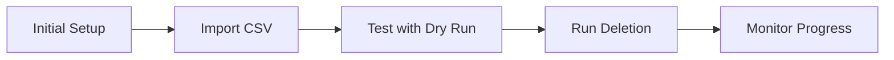

# Usage Guide

Complete guide to using the Gmail Cleanup tool for bulk email deletion.

---

## Table of Contents

- [Quick Start](#quick-start)
- [Initial Setup](#initial-setup)
- [Importing Data](#importing-data)
- [Testing with Dry Run](#testing-with-dry-run)
- [Running Deletion](#running-deletion)
- [Monitoring Progress](#monitoring-progress)
- [Control Functions](#control-functions)
- [Best Practices](#best-practices)

---

## Quick Start



**Estimated time:** 15 minutes setup + automated deletion

---

## Initial Setup

### Step 1: Create Sheets

Run the automated setup:

```
Gmail Cleanup → Setup → 1️⃣ Initial Setup (Create Sheets)
```

**What it does:**
- Creates **Senders** sheet (your deletion list)
- Creates **Log** sheet (activity tracking)
- Creates **Settings** sheet (configuration)
- Sets up headers and formatting
- Adds initial configuration

**Result:**

You'll have three new sheets in your workbook:

| Sheet | Purpose |
|-------|---------|
| **Senders** | List of email senders to delete |
| **Log** | Activity history and results |
| **Settings** | Configuration options |

---

### Step 2: Verify Setup

```
Gmail Cleanup → Setup → ✅ Test Setup
```

**Expected result:**

```
Setup Test - SUCCESS ✅

All tests passed!

Sheets: Found
Gmail Access: Working
Checked Senders: 0
Dry Run Mode: true
Batch Size: 50

Ready to run!
```

If test passes → Continue to import data

If test fails → Check [Troubleshooting](#troubleshooting)

---

## Importing Data

### CSV File Format

Your CSV file should have these columns:

```csv
Email,Count,Category
newsletter@example.com,1250,Newsletter
promotions@store.com,567,Promotional
notifications@social.com,432,Social Media
```

**Column descriptions:**

| Column | Required | Description |
|--------|----------|-------------|
| Email | ✅ Yes | Sender email address |
| Count | ⭐ Optional | Expected number of emails (informational) |
| Category | ⭐ Optional | Classification (for your reference) |

**Example:** See [sample_senders.csv](../sample_senders.csv)

---

### Import Process

#### Method 1: Menu-Guided Import (Recommended)

```
Gmail Cleanup → Setup → 2️⃣ Import CSV Data
```

**Steps:**

1. Click the menu item
2. Dialog appears with instructions
3. Click OK
4. Sheet activates at cell B2
5. Open your CSV file
6. Select ALL data (including headers)
7. Copy (Cmd+C or Ctrl+C)
8. Go back to Google Sheet
9. Paste (Cmd+V or Ctrl+V)

**After pasting:**

```
Gmail Cleanup → Setup → 3️⃣ Finalize Import (Add Checkboxes)
```

This automatically:
- ✅ Adds checkboxes in column A
- ✅ Sets status to "Pending"
- ✅ Applies formatting
- ✅ Freezes header row

---

#### Method 2: Manual Import

If you prefer File → Import:

1. **Import file:**
   ```
   File → Import → Upload
   Select your CSV file
   Import location: "Insert new sheet(s)"
   Click "Import data"
   ```

2. **Copy data:**
   ```
   Select all data (not headers)
   Copy (Cmd+C)
   ```

3. **Paste to Senders sheet:**
   ```
   Go to Senders sheet
   Click cell B2
   Paste (Cmd+V)
   ```

4. **Finalize:**
   ```
   Gmail Cleanup → Setup → Finalize Import
   ```

---

### Verify Import

After import, check the Senders sheet:

**Expected structure:**

| A | B | C | D | E | F | G | H |
|---|---|---|---|---|---|---|---|
| Delete? | Email | Count | Category | Status | Emails Found | Deleted | Last Updated |
| ☐ | newsletter@ex... | 1250 | Newsletter | Pending | | | |
| ☐ | promotions@st... | 567 | Promotional | Pending | | | |

✅ **Checkboxes in column A**  
✅ **Email addresses in column B**  
✅ **Status = "Pending" in column E**  
✅ **Formatting applied**

---

## Testing with Dry Run

**Always test before real deletion!**

### Why Test?

- ✅ Verify email counts are accurate
- ✅ Ensure correct senders selected
- ✅ Check script is working correctly
- ✅ No actual deletion happens

### How to Test

#### Step 1: Select Test Senders

1. Go to **Senders** sheet
2. Check ☑️ **2-3 senders** (choose ones with 50-500 emails)
3. Pick senders you're confident about deleting

**Example:**
```
☑ newsletter@example.com    1250 emails
☑ promotions@store.com       567 emails
☐ important@bank.com        Leave unchecked!
```

#### Step 2: Verify Dry Run Mode

1. Go to **Settings** sheet
2. Find "Dry Run Mode" row
3. Ensure value is **TRUE**

**Settings sheet should show:**
```
Dry Run Mode    TRUE    ✅
```

#### Step 3: Run Dry Run

```
Gmail Cleanup → 🧪 Dry Run (Preview)
```

**Confirmation dialog:**
```
Dry Run Mode

This will PREVIEW what would be deleted 
WITHOUT actually deleting anything.

Continue?
```

Click **Yes**

#### Step 4: Review Results

**Check Log sheet:**

Example output:
```
Timestamp               Action      Sender                     Count  Status   Details
2026-06-29 10:30:00    DRY RUN     newsletter@example.com     1248   Success  Would delete 1248 emails
2026-06-29 10:30:15    DRY RUN     promotions@store.com        563   Success  Would delete 563 emails
```

**Check Senders sheet:**

| Delete? | Email | Count | Status | Emails Found | Deleted |
|---------|-------|-------|--------|--------------|---------|
| ☑ | newsletter@... | 1250 | Preview Complete | 1248 | 0 |
| ☑ | promotions@... | 567 | Preview Complete | 563 | 0 |

**What to verify:**

✅ **"Emails Found"** column shows actual Gmail count  
✅ **"Deleted"** column shows 0 (nothing deleted)  
✅ **Status** = "Preview Complete"  
✅ **Log** shows "DRY RUN" actions  
✅ **No emails** deleted from Gmail

#### Step 5: Verify in Gmail

Manually check Gmail:

```
Search: from:newsletter@example.com
```

- Emails should still be there
- Count should match "Emails Found" column

✅ **If counts match and nothing deleted → Test passed!**

---

## Running Deletion

### Before You Start

**Final checks:**

- [ ] Tested with Dry Run
- [ ] Reviewed all checked senders
- [ ] Backed up important data (optional)
- [ ] Read deletion confirmation
- [ ] Understand emails go to trash (30-day recovery)

---

### Step-by-Step Deletion

#### Step 1: Select Senders

Go to **Senders** sheet and check all senders to delete:

**Options:**

**Option A: Delete all**
```
Click column A header
All checkboxes selected
```

**Option B: Selective deletion**
```
Check individual senders
Review each one carefully
```

**Option C: Start small**
```
Check top 50 senders
Run deletion
Then check more later
```

#### Step 2: Disable Dry Run

1. Go to **Settings** sheet
2. Find "Dry Run Mode" row
3. Change **TRUE** to **FALSE**

**Before:**
```
Dry Run Mode    TRUE
```

**After:**
```
Dry Run Mode    FALSE    ⚠️ REAL DELETION ENABLED
```

**⚠️ Double-check this is FALSE before continuing!**

#### Step 3: Start Deletion

```
Gmail Cleanup → 🚀 Start Email Deletion
```

**Confirmation dialog:**

```
⚠️ Confirm Email Deletion

You are about to delete emails from 25 senders.

Estimated emails to delete: 12,450

⚠️ IMPORTANT:
- Emails will be moved to TRASH (not permanently deleted)
- You can recover them within 30 days
- Process may take several hours
- Script will run automatically in background

Continue with deletion?
```

**Read carefully!**

Click **Yes** if ready to proceed.

#### Step 4: Deletion Starts

**Success dialog:**

```
✅ Deletion Started

Email deletion has started!

The script will run automatically every 5 minutes.
Monitor progress in the Log sheet.

Performance:
- Batch size: 50 emails
- Processing ~100 emails per run
- Estimated: 125 runs needed

You can close this spreadsheet - it will continue running.
```

**What happens now:**

1. ⚡ Script processes first batch immediately
2. ⏰ Sets up automatic triggers (runs every 5 minutes)
3. 🔄 Continues until all emails deleted
4. 📝 Logs all activity
5. 🛑 Stops when complete

✅ **You can close the browser - deletion continues!**

---

## Monitoring Progress

### Real-Time Monitoring

#### Senders Sheet

Watch the **Status** column update in real-time:

| Status | Meaning |
|--------|---------|
| **Pending** | Not started yet |
| **Processing...** | Currently deleting |
| **In Progress** | Partially complete, will resume |
| **Complete** | All emails deleted ✅ |
| **No emails found** | No emails from this sender |
| **Error: ...** | Something went wrong |

**Other columns to watch:**

- **Emails Found**: Total emails discovered
- **Deleted**: Number deleted so far
- **Last Updated**: Timestamp of last action

#### Log Sheet

See detailed activity:

```
Timestamp               Action     Sender                  Count  Status   Details
2026-06-29 10:30:00    START      -                       0      Success  Starting deletion for 25 senders
2026-06-29 10:30:05    SUCCESS    newsletter@ex.com       1248   Success  Deleted 1248 emails
2026-06-29 10:31:15    INFO       BATCH                   1248   Success  Batch complete. Processed 1248...
2026-06-29 10:36:00    SUCCESS    promotions@st.com       563    Success  Deleted 563 emails
```

#### Settings Sheet

Track daily progress:

```
Total Deleted Today     1811
Last Run Date          2026-06-29 10:36:00
```

### Checking Progress

**Option 1: Open sheet anytime**
- Sheets update automatically
- Refresh page (F5) to see latest

**Option 2: Check stats**
```
Gmail Cleanup → 📊 Refresh Stats
```

Shows summary:
```
Statistics

Total Checked: 25
Completed: 3
Pending: 22

Deleted Today: 1811
```

### Progress Indicators

**Early stage:**
```
Most senders: Status = "Pending"
Few senders: Status = "Complete"
```

**Mid-way:**
```
Some: Status = "Complete"
Some: Status = "In Progress"
Some: Status = "Pending"
```

**Near completion:**
```
Most senders: Status = "Complete"
Few remaining: Status = "Processing..."
```

**Complete:**
```
All senders: Status = "Complete"
Log shows: "No more senders to process"
```

---

## Control Functions

### Pause Deletion

```
Gmail Cleanup → ⏸️ Stop Deletion
```

**What it does:**
- ⏸️ Stops automatic processing
- 💾 Saves current progress
- 🔄 Can resume later

**When to use:**
- Need to stop temporarily
- Want to review progress
- Approaching daily quota limit
- Found an issue

### Resume Deletion

```
Gmail Cleanup → ▶️ Resume Deletion
```

**What it does:**
- ▶️ Continues from where it stopped
- ⏰ Re-enables automatic triggers
- 🔄 Processes remaining senders

### Refresh Stats

```
Gmail Cleanup → 📊 Refresh Stats
```

Shows current statistics without affecting processing.

### Reset Status

```
Gmail Cleanup → 🔄 Reset Status
```

**What it does:**
- Resets all statuses to "Pending"
- Clears "Emails Found" and "Deleted" columns
- Allows re-running deletion

**When to use:**
- Want to re-run deletion
- Had errors and want clean start
- Testing different configurations

**⚠️ Warning:** Only use if you want to delete again!

---

## Best Practices

### Before Starting

✅ **Test with Dry Run** - Always!  
✅ **Start small** - Test with 5-10 senders first  
✅ **Review carefully** - Double-check sender list  
✅ **Backup if needed** - Export important emails  
✅ **Read confirmation** - Understand what will happen

### During Deletion

✅ **Monitor Log** - Watch for errors  
✅ **Check Gmail** - Verify deletions happening  
✅ **Be patient** - Large jobs take hours  
✅ **Don't interrupt** - Let it run  
✅ **Close browser OK** - Runs on Google servers

### After Completion

✅ **Check trash** - Emails moved there  
✅ **Verify inbox** - Important emails still there  
✅ **Review Log** - Check for any errors  
✅ **Empty trash** - After 30-day review period

### Performance Tips

**For speed:**
- Increase Batch Size to 100
- Run overnight
- Don't monitor constantly

**For stability:**
- Keep Batch Size at 50
- Monitor first hour
- Pause if errors appear

---

## Recovery

### Undoing Deletions

Emails are in **Trash** for 30 days:

1. **Open Gmail**
2. **Go to Trash**
3. **Select emails** to recover
4. **Move to Inbox** or other folder

**Or search in Trash:**
```
from:newsletter@example.com
```

### Selective Recovery

Recover specific senders:

1. Gmail → Trash
2. Search: `from:sender@domain.com`
3. Select all
4. Move to Inbox

---

## Troubleshooting

### Common Issues

**Script not running:**
- Check Dry Run Mode = FALSE
- Check triggers are enabled
- Review execution log

**Slow deletion:**
- Normal for large jobs
- Check daily quota not reached
- Verify batch size setting

**Errors in Log:**
- Check Gmail API errors
- Verify permissions
- Try reducing batch size

**No emails found:**
- Check sender email format
- Verify emails exist in Gmail
- Check for typos

---

## Next Steps

- [Advanced Configuration](CONFIGURATION.md)
- [Troubleshooting Guide](TROUBLESHOOTING.md)
- [FAQ](../README.md#-faq)

---

<p align="center">
<a href="INSTALLATION.md">← Installation</a> •
<a href="../README.md">Back to README</a> •
<a href="TROUBLESHOOTING.md">Troubleshooting →</a>
</p>
